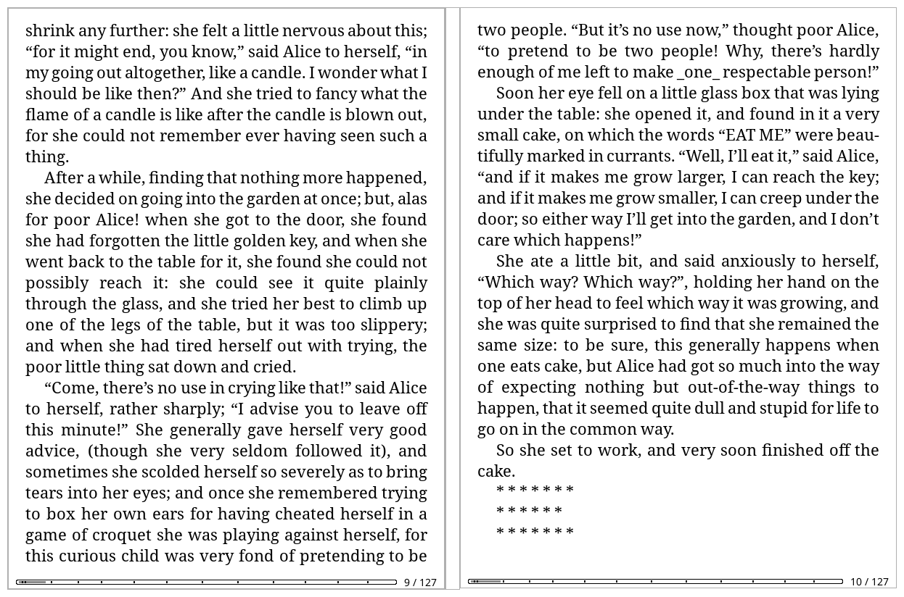

# KOReader Duo

Two e-readers side by side, showing one book as a two-page spread.

One device is the **leader**: it owns the page number. The other is the
**follower**: it shows the page it is given and can hand page turns back. A
single tap moves both.



**Mirror mode** shows the same page on both. A third device joins as slot 2
and shows the page after the follower's.

> [!WARNING]
> **"Over a wire" and the Debug menu are unfinished and under development.**
> They open the device's debug UART and can change its startup, which
> nothing else in Duo does. Read [Over a wire](#over-a-wire) before using
> either.
>
> Everything else — Wi-Fi, the router-free direct link, the spread, book and
> settings syncing — is unaffected and is what the plugin is for.

## Installing

Copy `duo.koplugin` into KOReader's `plugins` directory on **both** devices
and restart.

```sh
make install KOREADER=/mnt/us/koreader
# or: cp -r duo.koplugin /path/to/koreader/plugins/
```

It appears under **☰ → Network → Duo (two-device spread)**, in the reader
and the file manager.

Or unzip a [release](https://github.com/lidal/KoreaderDuo/releases) into
`plugins/`, which is the same folder by another route and needs no checkout.

### Updating

Duo does not update itself. What it does is carry a version — in `_meta.lua`,
where KOReader and the community plugin stores both look — so something else
can. [AppStore](https://github.com/omer-faruq/appstore.koplugin),
[Storefront](https://github.com/ultimatejimmy/storefront.koplugin) and
[Updates Manager](https://github.com/advokatb/updatesmanager.koplugin) each
find plugins from GitHub and install them on the device, which saves the USB
cable and the doing-it-twice.

Otherwise: unzip the new release over the old folder and restart. Settings
and the pairing code live in KOReader's own settings, not in the plugin
folder, so they survive.

The version is in the log's first line as `duo=`, which is the thing to
check before reporting anything.

## Pairing

**Duo → Connect the two devices…**, then two questions on each device: how
the pair should reach each other, and which device this one is.

1. **Over a Wi-Fi network** — both on the same router or hotspot — or
   **Directly, with no router**.
2. **This device leads (left page)** on one, **This device follows (right
   page)** on the other.

The second answer is kept. Which reader is the leader does not change from
one day to the next, so it is asked once and connecting stops asking after
that — **Duo → This device** shows what it settled on and changes it, and
changing it while the two are connected moves this device to the new side
rather than waiting for the next time. Set the two to opposite sides; it is
not one of the settings the leader shares, for the obvious reason. Pick
**Ask each time** to get the question back. Which *page* each device shows
is separate, under Layout.

The leader shows a pairing code. The follower searches and lists what it
finds, so there is normally no address to type. Over a direct link there is
nothing to pick: the leader is at a fixed address and the follower goes
straight there. The code is asked for once and kept, so connecting after
that is two taps and nothing typed; it is asked for again only if the leader
refuses it, and answering reconnects at once.

Open a book on the leader and the follower follows. Closing it takes both
back to the book list, and a book tapped on the *follower* opens on both —
the tap goes to the leader, which leads the way in.

If the search finds nothing — some networks block broadcasts — use **Type
the address by hand**.

## Wi-Fi and page-turn latency

A reader associated to a router sleeps its wireless card between beacons,
and the router holds small packets until the next one. A page turn pays for
that, possibly twice; a book transfer never does, because its traffic is
constant enough that the card cannot doze. This is most of why the same pair
feels immediate on a direct link and sluggish through a router.

**Keep the Wi-Fi awake** is therefore on by default, and applies only while
the two devices are connected — the radio sleeps as usual the rest of the
time. Turn it off under **☰ → Network → Duo** if you would rather have the
battery. It does nothing on a direct link, which has no router to wait for.

Measured on a pair of Kindle Paperwhite 3s: with power saving left on, page
turns lag noticeably; with it off they do not.

Setting it is not the same as it staying set — a driver puts its own default
back whenever the card re-associates, which is every time the device wakes.
So what Duo asked for on the way up is not believed: it asks again the moment
a link comes up, which is proof the association is behind it. After that it
reads the setting back rather than trusting the request, and asks again when it
finds power saving on. Three times, then it leaves the card alone. Not in the
first few seconds of a link, though: those are fragile whatever anybody does
to them, and changing power save is one more thing to go wrong while the
Wi-Fi is still settling.

## A direct link, with no router

For reading where there is no network: **Duo → Connect the two devices… →
Directly, with no router**, then pick which device this is.

The leading device makes the network — an access point where its driver
allows one, an ad-hoc cell otherwise — takes `169.254.13.1` and starts Duo.
On the other device, the same two taps choosing **This device follows**: it
takes `169.254.13.2` and connects on its own. It asks for the leader's
pairing code the first time, since the network's key comes from it.

Anything that is not a second reader — a laptop, a phone, desktop KOReader —
joins the network first, the ordinary way. It is called **`KOReaderDuo`**,
and its passphrase is derived from your pairing code, so it differs per pair
and neither device has to be told it; the host's screen shows it. **This
does not work if the link fell back to ad-hoc**, and the screen says so: an
ad-hoc cell carries the spread between two readers perfectly well, but
modern Wi-Fi daemons dropped ad-hoc support and phones never had it, so
nothing else will list the network. Another reader still joins, because it
joins by name rather than from a list.

**The ad-hoc fallback is unencrypted.** IBSS with WPA is unsupported by most
of the drivers this runs on, so the cell is formed with no key: anything in
radio range can join it and read what crosses. Duo signs its own messages
(below), so nobody can drive your pair or ask it for a book — but titles,
paths, page numbers and the bytes of any book being copied are in the clear.
Kindles land on this path, since their `wpa_supplicant` has no AP mode. If
that matters for what you are reading, use a Wi-Fi network instead, where
WPA2 covers the air.

The access-point path *is* encrypted, with WPA2 and a per-pair key. The
script refuses to build one with no passphrase rather than quietly bringing
up an open network — drive it by hand and you supply `DUO_PASSPHRASE`
yourself.

Whether a given device can host at all comes down to its Wi-Fi stack:

```sh
/mnt/us/koreader/plugins/duo.koplugin/tools/duo-direct-link.sh probe
```

`wpa_ap` is the line that matters, not what `iw phy` claims the driver can
do. Kindle firmware ships a `wpa_supplicant` built without `CONFIG_AP` — AP
mode drags in most of hostapd, so it is the first thing dropped — and such a
build advertises AP, accepts the configuration, forks into the background
and then silently refuses. The probe reads the giveaway out of the binary
and picks ad-hoc up front. Ad-hoc needs nothing from `wpa_supplicant`: it
goes through `iw` and the kernel.

Three methods are driven automatically: AP where it works, ad-hoc where it
does not, and `iwconfig` ad-hoc for pre-`iw` drivers. Wi-Fi Direct
(`P2P-GO`) is reported but not driven.

The script also does `host`, `join`, `status` and `restore`, and takes
`--dry-run`. It verifies the interface really reached AP or ad-hoc rather
than trusting that the commands ran, and its last line is `mode=`.
**restore** does the whole job: leaves the cell, puts the interface back to
managed — one left in ad-hoc is one the system's Wi-Fi daemon cannot use,
and it never says so — and toggles the device's Wi-Fi switch.

**Duo → Link → Check the direct link now** asks the same question from the
menu and answers on screen. Duo works out which side it is on from the
addresses, so it makes no difference whether the link was built from the
menu or by hand over SSH.

Picking **Over a Wi-Fi network** while a direct link is up hands the radio
back first and waits for the usual network before pairing, so the two do not
end up looking for each other over the cell they were leaving. This applies
to a link built by hand over SSH too — that menu item means what it says,
and the direct-link path is one screen away.

### Going out, and coming home

**Duo → Link → Switch to a direct link** and **Switch to Wi-Fi** move *both*
devices in one tap, keeping the sides they already have — no walking back
through the pairing screens and no doing it twice. The device you tap asks
the other one, waits for it to say it heard, and then they go together; on a
direct link the host makes the cell first and the joiner follows a moment
later. If there is nobody to ask, or the other device does not answer, this
one switches anyway and says so.

Switching to Wi-Fi hands the radio back, waits for your usual network, and
starts Duo again over it.

Waking somewhere with no Wi-Fi at all, Duo offers the direct link itself
rather than sitting there retrying a leader that is not on any network. It
asks rather than acts: building the link takes the Wi-Fi away from the rest
of the reader, and somebody about to walk back into range would not thank
you for it.

## The shared folder

Duo syncs **one folder**, `/books` by default, rather than whatever you
happen to be looking at. Both devices need the same books for the halves to
line up, and a folder is a thing both devices can name.

When Duo connects it compares the two folders and, if they differ, offers to
copy the difference, to wait while you do it by USB, or to disconnect.
Nothing else happens until that is answered — a pair still working out which
books it has is not a pair that should be reading, and copying in the
background made every page turn wait behind a few hundred kilobytes of book.

Set the folder under **Duo → The shared folder**. It is a shared setting, so
the leader's value wins on connecting.

## The book list, spread too


The file browser spreads the same way a book does. It works in list and
cover-grid modes, and on KOReader's History and Collections as well as
folders.

**Both devices have to be in the same list.** Page 2 of Favourites and page
2 of a folder have nothing to do with each other, so every listing carries a
name — the folder's path, or which view, or which collection — and the two
compare names before either offsets a page. When they differ the follower
says so and stays put.

**Duo will not put you in a view.** It follows you into a *folder*, because
a folder is a place. A library view is a choice you made on that device.

Only KOReader's own file browser and the widgets built on it are spread;
plugins that draw their own list from scratch are not.

## Sending the book

If the follower is asked to open a book it does not have, the leader sends
it down the same link.

- Only the book the leader actually has open can be asked for. No arbitrary
  paths.
- Books land in a `Duo` folder inside your library.
- Written to a part-file and moved into place only once the size matches, so
  half a book is never left behind.
- No size limit; a book past about 100 MB says so first, and any transfer
  can be stopped from the menu.

Speed is bounded by the devices rather than the link: bytes travel as text
on the same line-based link the page numbers use, so everything is encoded
on the way out and decoded on the way in. Both ends run off lookup tables,
and each turn of the poll loop spends a slice of *time* on the transfer
rather than a fixed number of chunks. Between two KOReaders on one machine a
30.7 MB book crosses in 7.1 s with the reader still answering in 21 ms; real
hardware over real Wi-Fi is slower.

The encoding is base64 in the **URL-safe** alphabet, which matters: the
protocol escapes anything outside a restricted set, `+` and `/` are outside
it, and a compressed file produces enough of them to push a chunk past the
line limit.

### Putting a book on both at once

[localsend.koplugin](https://github.com/kaikozlov/localsend.koplugin) pairs
well with this: send from a phone or laptop to both readers in one go and
the shelves match before Duo is even running, with nothing to copy over the
link. Both devices have to be on your ordinary Wi-Fi for it — on a direct
link they are on a cell of their own that the sending device cannot reach.

## Matching typography

A spread only works if both devices break lines in the same places.

On connecting, the leader's settings win; afterwards a change on *either*
device moves the rest. Matched: typeface, size, weight, hinting, kerning,
line and word spacing, word expansion, CJK scaling, margins, view mode,
columns, block rendering mode, zoom, embedded styles and fonts, status bar.
Left alone: rotation, night mode, frontlight, refresh settings.

**Undo: restore my own typography** puts back what this device had before
Duo first touched it. The snapshot is only taken when something really
changed.

**The reload question is asked once.** Some style changes leave the
rendering engine unable to draw the book correctly without building it
again, and KOReader offers to do that — on both devices, since Duo made the
change on both. The two answers need not agree, and a book built one way
here and another there paginates differently. Duo asks on the device you are
holding and carries the answer across; saying no does nothing on either.

Two things cannot be fixed by matching: a typeface only one device has (Duo
says so rather than leaving the pages misaligned), and different screen
sizes, which paginate differently whatever the settings. Reflowable formats
only — a PDF has the pages the file says it has.

**Match the frontlight** keeps both at the same brightness, warmth included.
Brightness is carried as a share of each device's own range, since KOReader
drives a Kindle's light 0–24 and a Kobo's 0–100.

## Settings

Everything is under **☰ → Network → Duo (two-device spread)**. The top line
is the live connection: role, peer, and the pages on show.

| Setting | What it does |
| --- | --- |
| **This device** | Whether this reader leads or follows, kept so connecting stops asking. |
| **Layout → Two-page spread** | Leader shows N, follower N+1. A turn moves by two. |
| **Layout → Mirror the same page** | Both show the same page. |
| **Layout → This device holds the right-hand page** | Swaps the sides. |
| **Match typography** | Both devices lay the book out alike. On. |
| **Match the frontlight** | Same brightness and warmth. On. |
| **Keep the Wi-Fi awake** | Stop the radio dozing while Duo is running. On. |
| **Link → Over a network / Over a wire** | Which kind of link. Picking one moves both devices. |
| **Link → Device**, **Link → Speed** | Which character device, and how fast. Per device: set both to match. |
| **Link → Let the line ask the other end to wait** | XON/XOFF. Off — unsafe on a line that is also the console. |
| **Link → Switch to a direct link / Switch to Wi-Fi** | Move both devices between the two, keeping their sides. |
| **Share the book list too** | Spread the file browser as well. On. |
| **Lock one, lock both** | Sleeping either sleeps the other. On. |
| **Keep the whole library in step** | Fetch whatever the shared folder is missing. On. |
| **Covers now, books when you open them** | Fill the shelf with covers, fetch each book on first open. Off, EPUB only. |
| **Page turns from the other device** | Off makes the follower a display only. |
| **Follow the leader's book** | Open here when the leader opens there. |
| **Send the book if the other device lacks it** | Hand the file over the link. On. |
| **Start Duo when KOReader starts** | Reconnect on launch in the last role. A wire always does. |
| **Watch the link closely** | Look at the link every 20ms while connected, rather than when the loop offers. On; costs ~6ms of processor a second. |
| **Debug → Say what Duo is doing** | The messages at the top of the screen — connected, matched the font size, the book has been sent. On. |
| **Write a log file**, **Log everything** | See *Reporting something that went wrong*. Both off. |
| **Pairing code** | Shared secret. Empty means any device may connect. |
| **Device name**, **Port** | 9970 by default; UDP 9971 for the search. |

Two Dispatcher actions are registered for gestures and keys: **Duo:
start/stop** and **Duo: resync now**.

**Settings that describe how the pair behaves are shared, and the leader is
the tiebreaker.** On connecting the leader's values win; change one
afterwards on either device and the other follows. Not shared: the port,
pairing code, peer address and device name — those are what let the two find
each other.

## How it works

- **One authority.** Only the leader decides what page anything shows. A tap
  on the follower is a request. The screens cannot drift apart because only
  one of them is ever deciding.
- **The follower still moves first.** It works out where it is about to land
  from the leader's own numbers and goes there while the request is in
  flight, so the device you tapped is not the last to respond. The two are
  out of step for the same half a round trip either way; what changes is
  which end of it you are looking at.
- **Page turns are intercepted, not simulated.** Every tap, swipe, gesture
  and button lands in `onGotoViewRel`, so Duo wraps that one method.
- **Jumps are noticed rather than intercepted.** A link, the table of
  contents, a bookmark and the slider all move a device without going near
  `onGotoViewRel`. A follower is only ever *sent* to a page, so any page it
  finds itself on that it was not sent to is a jump its reader made: it says
  where it wants to be and the leader works out where to sit.
- **Opening a book is answered, not assumed.** The leader names the book and
  the other device says what became of it. Only silence is retried, and then
  given up on out loud.
- **The connection outlives the plugin.** KOReader rebuilds a plugin
  instance for every document, so the engine lives in a module singleton
  (`duo/core.lua`) and the instance only attaches a binding.
- **Pairing without sending the secret.** The leader challenges with a
  nonce; each side answers `SHA-256(nonce:code)`. The code never goes on the
  wire.
- **The rest of the conversation is signed.** Both ends derive a key from
  the code and *both* nonces, and every message after the handshake carries
  an HMAC-SHA-256 tag. The proofs alone only show that the far end knows the
  code, not that it is the end you are talking to — a device in the middle
  can relay a challenge and its answer and then sit between two peers that
  each believe they proved something. Mixing in both nonces means a relayed
  handshake yields two different keys, and the first signed message fails.
  The body of a book is the one thing not signed: it is megabytes, the
  hashing is Lua rather than C, and it would cost more than the encoding
  that already bounds a transfer. An attacker positioned to inject can
  therefore corrupt a book in flight, which the size check turns into a
  failed transfer rather than a bad book.
- **What none of this is.** There is no encryption. Anyone who can see the
  traffic can see what you are reading and the books being copied; what they
  cannot do is join the pair, drive it, or ask it for anything.
- **Wire format** is one line per message — `STATE page=13 pages=300` —
  percent-encoded, legible in a packet dump.
- **Polling** happens in KOReader's own UI loop, which visits registered
  sockets at least every 50 ms. No threads, no blocking reads. Both the
  sending and receiving sides take a fixed slice of that tick rather than a
  fixed number of messages, so a slow device stays responsive and a fast one
  is not held to its pace.

## ZenOS

[ZenOS](https://github.com/AnthonyGress/zen_ui.koplugin) replaces KOReader's
file browser with a library of views. Duo spreads those the same way it
spreads a folder, because ZenOS patches KOReader's own widgets rather than
replacing them — every view is a `Menu` underneath, with the same `page`,
`perpage` and `onGotoPage` the spread arithmetic already uses. Nothing about
ZenOS is hard-coded; the same support arrives for any skin built on those
widgets.

**Tried with ZenOS on both devices and it appears to work**: both plugins
load together, the pair spreads pages through a book, and Duo reads ZenOS's
patched collection view as the collection it is. Duo is developed against
vanilla KOReader and that is where nearly all the testing happens, so treat
this as working but lightly exercised.

The multi-page library spread is verified on plain KOReader over the same
widgets ZenOS patches, not under ZenOS itself — its first-run guided tour
does not survive a headless session.

## Reporting something that went wrong

**Duo → Write a log file** keeps a record you can copy off the device over
USB. Off by default; worth switching on before reproducing something, and
off again afterwards. It holds book and folder names, device names and
addresses; not your pairing code and nothing you have read. It is capped and
rolled over once, so it cannot fill a card.

**Log everything** adds the running commentary underneath: every message
across the link, how long each turn of the event loop took, and how long a
page turn took to come back. Gaps near 50ms with a long round trip mean the
network; gaps of hundreds of milliseconds mean Duo is not being run often
enough to answer quickly whatever the network does.

The menu says where the file is and offers to show the last few lines.

`work` in that line is time spent inside Duo, and it is time the reader
cannot draw or answer a tap: building the link runs a shell script the event
loop waits for, about five seconds. Nothing is rebuilt for a moment after
waking for that reason — a screensaver that cannot be painted over is a
device that looks like it never woke up.

A gap between two polls of more than a few seconds means the loop was not
running at all, and Duo says so: `the loop stopped for 55s`. On a Kindle the
system can suspend underneath KOReader without KOReader's own suspend path
running, so this is often the only record that the device slept. Duo treats
it as a sleep whether or not it was told about one, and does not charge the
lost time to the other device.

## Tests

```sh
make test                                   # the fast suite
make real KOREADER=/path/to/koreader        # two real KOReaders
```

598 tests, with the interesting parts unmocked: two and three device
processes over real TCP, two network namespaces on a link-local /16 for the
router-free link, and a follower in its own mount namespace with a different
folder at the same path so books really have to travel.

`make real` runs two KOReader processes under `xvfb-run`, each with its own
`KO_HOME` and a small control plugin, driven by the same controller as the
simulated devices. It exists for what the harness cannot model: how crengine
really moves a page across a relayout, what a real widget does when it is
torn down. It refuses to run against a KOReader that already has a Duo
inside it — KOReader scans its own `plugins` folder first, so the tests
would measure whatever was there before.

```sh
luajit tools/duo-demo.lua 3      # three devices, printing what each displayed
luajit tools/duo-menu-dump.lua   # the menu as the device builds it
```

## Over a wire

> [!CAUTION]
> **Work in progress, and the only part of Duo that can leave a reader
> unable to start.**
>
> Two Paperwhite 3s stopped booting during the session that built this —
> frontlight on, screen frozen, no progress, and no recovery from a battery
> pull. Both came back after being run flat and charged properly, which is
> the useful part of the story: a full discharge does not repair a
> filesystem and does not restore a missing startup job, so whatever it was,
> it was not something written to disk. The evidence points at a brownout —
> charge enough to light the frontlight and begin booting, not enough to
> finish — and nothing Duo wrote has been implicated since.
>
> Two real faults were found while looking, and both are fixed:
>
> * Finding the login prompt matched any startup job mentioning `getty` or
>   `/bin/login` anywhere in it. On a reader whose whole boot sequence lives
>   in `/etc/upstart`, that could move aside jobs other jobs wait on — and a
>   job that never starts is a boot that never finishes. It now requires the
>   job to name the configured device *and* start a login on it.
> * Writing to a system file remounted the root filesystem read-write and
>   did not always put it back. A reader's root is read-only precisely
>   because these devices lose power without warning, and a journalled
>   filesystem that was writable at that moment can come back damaged. Every
>   write now shuts it again on the way out.
>
> What remains true regardless: this part of Duo opens the debug UART and
> can move a file in the device's own startup, and **a reader that will not
> start cannot be fixed from its own menus**. Have the UART wired and a
> bootloader you can interrupt before using the one entry that writes. The
> electrical half of this — baud rates, framing errors, a full FIFO, whether
> flow control does what it says on this driver — is not covered by the
> tests and cannot be; a pseudo-terminal proves the framing, the handshake
> and the state machine, and nothing about a wire.
>
> The same summary is in the plugin: **Duo → Debug → Read this first**, and
> the menu marks which entries only read, which forget at the next reboot,
> and which one writes to the device's own startup.
>
> If a reader has already stopped booting, the way back is at the end of
> this section — and start by charging it, which is what worked.

**Duo → Link → Over a wire** talks down a character device instead of a
network: the two readers' debug UARTs, TX to RX with a common ground. On a
matched pair no level shifting is needed, since both sides are the same.

The attraction is that there is nothing to reconnect. Every fault this
plugin has chased — associating, power saving, cells that have to be rebuilt,
links that die at eight seconds — is a radio fault. A line is simply there
whenever both devices have power, so the leader starts the handshake and the
follower answers whenever it wakes.

**A wire is a channel, not a connection**, and Duo treats it as one. A
connection has a lifecycle both ends observe because the transport tells
them; a wire has none. So a sleep does not put it down — the descriptor is
still open on the way back, the line is still there, and the session key and
slot are still good, which is why waking on a wire costs a poll rather than
a reopen and a handshake. Silence steps the session back over the same
stream instead of closing it, because on a wire silence means the other
reader is busy or asleep and proves nothing. A line that does not parse is
skipped, because on these readers the wire is also somebody's console. And
whichever end is not paired calls down the line once a second: that is what
catches a reader that restarted, which arrives on the same channel rather
than a new socket and would otherwise be signed at with a key it threw away.

**Speed.** **Link → Speed** offers 9600 to 921600. 115200 is what the
console runs the UART at and is the safe answer; the chip will do eight
times that, which on a book is the difference between minutes and seconds.
It cannot be agreed over the line — the two ends have to match before either
can say anything — so set it on both, then measure. Duo's own traffic is
about 80 bytes a second and fits at any of them. Books still travel better
with something else ([localsend](https://github.com/kaikozlov/localsend.koplugin)
does it well).

Duo sets `clocal` and `-crtscts` on the line, and both matter with three
wires. CLOCAL clear means the line waits for a carrier that TX, RX and
ground do not carry, so a blocking open never returns — which is what a
reader that never finishes starting looks like. CRTSCTS means the kernel
will not transmit until CTS is asserted, which on those same three wires it
never is.

**Link → Let the line ask the other end to wait** is software flow control
(XON/XOFF), and it is **on**. There is no other flow control on three pads,
and without it a reader stalled on an e-ink refresh overruns the far end's
four-kilobyte buffer at any speed on offer. What arrives then is a message
with bytes missing out of the middle of it — which reads as a pairing code
that does not match, or a signature that does not check, and neither has
anything to do with what went wrong.

**Calling down the wire will not show this.** Both devices do nothing but
read for those two seconds, so nothing overruns and the measurement comes
back clean at the top speed. It only bites in use, which is worth knowing
before concluding from a clean measurement that the line is fine.

Turn it off only for a line that is also a live console: one stray XOFF
stops that port until an XON that may never come, and everything writing to
the console blocks behind it. A wire whose console is still live does not
work at all — the login prompt eats the bytes the other reader sends — so
in practice that state is behind you by the time this matters.

A message that does not check out no longer ends the session either. On a
network an unsigned message means an injection or a relayed handshake and
there is nothing to do but hang up; on a wire it is almost always a lost
byte, and hanging up turns that into a fresh handshake plus the whole of
the pair's state pushed across again — itself a burst large enough to lose
the next one. The message is dropped and reading goes on. Five in a row is
a different thing, and makes the session again over the same line.

Before it will carry anything: set **Device** to the right node on each
reader, then pick **Over a wire** on either one. Picking it moves both, the
same way switching to a direct link does — the two are talking at the moment
the question is asked, so it gets settled between them rather than left to
be done twice in the right order. A device with nobody to ask still switches
and says so; do the same over there. The node itself stays per-device, since
one reader may reach the line through a different one.

**On a wire there is no connecting.** Two readers joined by copper have no
route to pick and, once each knows whether it leads or follows, no question
left to answer: the menu entry reads **Start Duo on the wire** and that is
the whole of it. It starts itself when KOReader does, too, without the
autostart setting — that setting exists because bringing Duo up on Wi-Fi
means bringing the radio up and holding it awake, and a character device
costs none of that. Stopping Duo by hand is still respected.

**There is no pairing code on a wire.** A code answers "is the thing on the
other end the reader I mean?", which on a network is a real question —
anything on the same Wi-Fi can dial the port — and on three soldered wires
is not. There is one other end, it is the one you wired on, and anything
that can reach the line can already reach far more than Duo. Whatever the
code is set to, and whether it is set at all, the two pair.

The signing does not go away with it: both ends derive their key from a
known constant instead, so every message still carries a tag. That tag is
doing a second job the code was not — telling a message apart from the
console noise this line also carries — and it is the job worth keeping.

On these readers `/dev/ttymxc0` is both the debug UART and the console, so
two things are in the way of using it: a login prompt reading the bytes the
other device sends, and the kernel writing its own messages down the same
wire. **Duo → Debug → Free the line** stops both — it names what it is about to
stop and asks first. But it comes straight back under a new number, because
something restarts it: on these readers that is `/etc/upstart/console.conf`,
run by `init.exe`, which never reads `/etc/inittab`. **Turn off the login
prompt** moves that job aside — renamed rather than edited, so putting it
back is exact. The same menu entry puts everything back. Do it on both
devices.

### If a reader will not boot

Charge it first, on a wall charger, for several hours. A frontlight left on
flattens the battery, and a deeply discharged reader looks exactly like a
broken one: light on, screen frozen on whatever it last drew — e-ink holds
its last frame with no power at all, so a stuck image says nothing about
whether anything is running. Then hold power for 40 seconds and release.
There are no button combinations on a Paperwhite; duration is the only
control there is.

Then use the UART, which is the only step here that produces information
rather than hope. 115200 8N1, power on, and watch: nothing at all means the
trouble is not software; U-Boot and then a stall means read what it says
last; `fsck` or mount errors mean the filesystem rather than the jobs.
Check the logic level before connecting a USB serial adapter — two
identical readers can be wired to each other *because* they are identical,
and a generic adapter is usually not.

**Whatever Duo moved aside, it can put back.** Every job it moved is still
sitting beside its old name with `.duo-off` on the end, so from any shell:

```sh
mount -o remount,rw /
for f in /etc/init/*.duo-off /etc/upstart/*.duo-off; do mv "$f" "${f%.duo-off}"; done
[ -f /etc/inittab.duo-original ] && mv /etc/inittab.duo-original /etc/inittab
mount -o remount,ro /
```

`ls /etc/init/*.duo-off /etc/upstart/*.duo-off` first: if it lists only a
console job, or nothing at all, then the moved jobs are not what stopped it
and the filesystem is the thing to look at instead.

Getting a shell on a reader that will not boot means the same UART this
whole section is about — the wire is the way back in. Interrupt the
bootloader over it and boot with `init=/bin/sh`. Note that a matched pair
of readers can be wired directly to each other because both sides are the
same; a USB serial adapter is usually **not** the same, so check the logic
level before connecting one.

Duo only ever moves a job that names the configured device *and* starts a
login on it. An earlier version matched any job mentioning a login prompt
anywhere, which on a reader whose whole boot sequence lives in
`/etc/upstart` could take out jobs that other jobs wait on — and a job that
never starts is a boot that never finishes.

**What starts the login prompt** is the one to run first if any of this
misbehaves: it says what process 1 actually is, which decides whether
`/etc/inittab` is read at all.

**Duo → Debug** answers the rest without a keyboard. **What the wire looks
like** lists the serial devices on the reader, says whether the one Duo is
set to opens, whether a login prompt is holding it, and whether the kernel
logs to it. **Call down the wire** answers three questions in
order — run it on both devices within a few seconds of each other.

*Is anything there?* Each end writes a token drawn fresh for the run,
followed by its own name, and listens for the other. The token is what
separates a wire that works from a device hearing its own bytes come back:
two readers of the same model answer to the same name. Bytes that arrive but
never parse is its own answer, and it names the cause — the two ends are not
at the same speed, which looks exactly like a broken cable and is not.

*How fast, and how clean?* Once each end has heard the other, both send
numbered lines as hard as the line will take them for two seconds and count
what arrives. That is the throughput of this cable at this speed, in this
room, rather than the number on the setting — and the numbers say what was
lost. A gap in them is bytes the line dropped; a line that will not parse is
bytes it changed. Either means the speed is above what this wiring carries,
which is the one thing no amount of reading about baud rates will tell you.

The gaps are counted inside what was actually seen, not from the other
device's first line. The two cannot start together — each begins when it
hears the other — so whichever spoke first has a head start, and counting
from one turns that head start into loss. Which is worth knowing as a
principle: **if losses fall as the speed rises, they are not electrical.**
A cable that will not hold a speed gets worse as the speed goes up, never
better, so anything that improves with baud is being produced somewhere
above the wire.

A failed pairing tells you none of it.

It stands Duo's own link down while it runs, and puts it back afterwards.
Two descriptors open on one tty do not each get a copy of the line — the
kernel hands every byte to exactly one of them — so a test running beside a
live link splits the conversation with it. What that looks like is one
reader hearing the other perfectly and the other hearing nothing, which
reads as a broken wire and is not.

**If one device hears the other and not the other way round**, sending works
on both and only one side's listening does not, so everything worth checking
is on the deaf device's receiving side. In order: a login prompt on *that*
device reading the bytes before Duo can (much the commonest, and the test
now says so before it starts rather than after it fails); the wire into that
device's RX pad, which is the one joint the working direction does not test;
and the speed, if the two differ.

Two things to know before wiring anything up. The device is a guess and says
so: `/dev/ttymxc0` is the usual debug UART on these readers, and it is
usually also the console, so a getty may be reading the same bytes and
answering the other reader with a login prompt — stop it first. And what the
suite proves about this is narrower than it looks. Over a pseudo-terminal it
covers the framing, the handshake, the state machine, the stty a real device
gets, a sleep that changes nothing, an hour of frozen loop that changes
nothing, a step-back that keeps the line, a restarted reader heard rather
than waited out, and console noise read through. What a pseudo-terminal
cannot show is anything electrical: baud rates, framing errors, a full FIFO,
or whether flow control does what it says on this driver. Those wait for a
real wire, which is what the measurement in **Call down the wire** is for.

## What a page turn actually waits for

Not the link. Over a wire a message crosses in about a millisecond, and
over Wi-Fi the round trip measures around a hundred — what it waits for is
the *other device noticing*. Duo is pumped by KOReader's event loop, which
offers it a turn every fifty milliseconds at best and every hundred and ten
while something is being drawn, so a message can sit unread for longer than
it took to cross.

There is no cleverer answer than looking more often. The device about to be
sent a page has no way of knowing: nothing woke it, it has had no input, and
the first it can learn of a page turn is by asking. Prediction does not help
either — the turn anybody notices is the one after a pause, and nothing
precedes it.

So two things, and both are done. The device that was tapped never waits at
all: it moves its own screen straight away and puts the message on the line
*before* doing so, since drawing a page on e-ink is the better part of a
second and the far screen should be starting its own at the same moment.
And **Watch the link closely** (on) looks at the link every twenty
milliseconds for as long as the two are connected, rather than waiting to be
offered a turn.

The cost of that is measured rather than guessed. Duo's own log reports the
work it does per look: **0.2 ms** when the line is quiet. Fifty milliseconds
between looks is four milliseconds of processor a second; twenty is ten. Six
milliseconds a second, on a device Duo is already holding awake because it
is connected, next to a frontlight. Turn it off if you would rather have
that back — a two-second burst after each page turn is kept either way,
though that buys the second turn of a burst and not the first.

What is left is the e-ink refresh, which is most of what anyone sees and is
not Duo's to give back.

A number worth reading correctly if you turn the log on: `turn answered in
546ms` is **not** what you waited for. It measures from asking to hearing
back, and the device that asked has already moved its own screen and is
busy drawing it — it cannot read the reply until that finishes, so its own
refresh is inside the number. The gap between the two screens is a poll,
not half a second.

## What happens when the line eats a message

Over Wi-Fi, nothing: TCP checksums what it carries and retransmits what it
loses, and 802.11 adds a CRC under that. Corruption never reaches Duo and
loss is repaired below it.

A wire has none of that. Three soldered pads carry no parity, no CRC and no
acknowledgement, so a message the line eats is gone and nothing underneath
will bring it back. Duo does not add a retransmit layer for it — that would
be re-implementing TCP, badly, over a link that mostly does not need one.
Three cheaper things cover it instead.

**Detection is already there, and it is strong.** Every message after the
handshake carries a 64-bit truncated HMAC, built to stop injection and
doubling as an integrity check: a message with a byte missing fails it
essentially always. Newline framing contains the damage to one line, and
the grammar rejects most of the rest before the tag is reached. On a wire a
failed tag means a damaged message rather than an attacker, so the message
is dropped and reading goes on.

**Correction is the heartbeat.** Everything Duo shares is a statement about
the world rather than an instruction — "you are on page 12", not "advance
one" — so nothing needs replaying in order and nothing needs a sequence
number. The leader's heartbeat carries where it stands and an eight-character
fingerprint of the settings, typography and light the two are supposed to
share; a follower that disagrees asks for the state again and is sent
everything. Any lost STATE, BROWSE, CONF, TYPO or LIGHT therefore puts
itself right within about two seconds, at a cost of a few bytes on a message
that was already being sent.

**A page turn is the exception**, because it is the one message that is an
instruction. It carries a name; the follower asks again if nothing comes
back within a second or so, and the leader ignores a repeat it has already
served rather than turning twice. A refused turn — the end of the book — is
answered rather than met with silence, which from the other end is
indistinguishable from a turn the line ate.

**Books are checked with a CRC-32.** Chunks are the one thing here that
carries no signature: an HMAC over every kilobyte of a several-megabyte file
is more than a reader's processor should be asked for. The byte count
already catches a chunk the line ate; the digest catches a chunk that
arrived the right length and wrong. A book that does not match is thrown
away rather than kept, because a book with a bad byte in it is worse than no
book — nothing will ever look at it again.

## Reconnecting the plain way

**Duo → Reconnect the plain way** is on by default: a fixed second between
tries, and keep trying. No backing off, no waiting for the other device to
go first, no pause to let the screen redraw before a rebuild.

Switching it off gives the adaptive timing instead — a dial backoff, a
repair backoff to a ten-minute ceiling, an eight-second head start for the
joining device, a pause for the screen. All of that was written from faults
found in logs, and a fair number of those faults turned out to be the timing
itself misfiring rather than the network.

Measured on two Kindles over a dozen wakes each way, plain came back at
least as quickly and never worse: 1, 3, 14, 8 seconds against 2, 4, 2, 10,
12, 18, 16, 2. Not enough to call it faster — enough, with the bug history
beside it, to stop making the complicated one the default.

It is one of the settings the leader shares, so both devices move together,
and the benchmark records which way a run used.

## The reconnect benchmark

**Duo → Run the reconnect benchmark…**, on *both* devices. Twenty minutes of
taking the network away and giving it back, timing what Duo does about it.

Each trial takes the interface down, freezes the event loop the way a
suspend does, gives it back, and times the reconnect. It measures Wi-Fi
first, with the sleep announced and unannounced, then moves the pair to a
direct link and sweeps the joiner's head start from nothing to twelve
seconds, twice at each value. Then it puts the Wi-Fi back.

You do not have to tap them together. The second device to start names the
second the run begins on, over the link they are already on, and the first
comes to meet it — starting the plan over if it had begun alone, since a
trial run against nobody measures nothing. Failing a link they align on the
wall clock, which is why the notification says the exact second.

Each writes `benchmarkHOST.log` or `benchmarkFOLLOWER.log` beside the Duo
log, ending in a table of every trial: how long the reconnect took, how many
dials and rebuilds it needed, and which cell the radio ended up in. That last
column is the interesting one on a direct link — two different addresses in
the two files means the pair formed rival cells of the same name instead of
meeting in one.

It says where it has got to on screen as it goes, and holds the reader awake
for the whole run — a device left alone goes to sleep, and a benchmark
measuring reconnects while asleep can only fail at it.

**The reader is unusable while it runs**, on purpose: twenty seconds of every
minute are the event loop deliberately stopped.

## Releasing

Set the version in `duo.koplugin/_meta.lua`, then tag it:

```sh
make dist                 # dist/duo.koplugin-<version>.zip, and its sha256
git tag v0.9.0 && git push origin v0.9.0
```

The tag runs the suite, builds the archive and publishes it. It refuses a
tag that disagrees with `_meta.lua`, because a plugin store compares those
two numbers to decide whether a device needs updating, and one that lies
means a device that never updates or one that updates forever.

The archive holds a single `duo.koplugin/` folder and nothing of the tests
or the Makefile — the folder as KOReader wants it, ready to unzip into
`plugins/`.

For the stores to find the repository at all it needs the `koreader-plugin`
topic, which is set in GitHub's repository settings rather than here.

## What has not been verified

- Anything on e-ink hardware beyond a pair of Kindle Paperwhite 3s. Two
  emulators on one machine share a clock, a disk and a loopback network, and
  agree about fonts.
- Devices with different screen sizes. They paginate differently whatever
  the settings; Duo warns rather than pretending otherwise.
- Which field holds a view's menu has changed between KOReader releases. Duo
  probes several and gives up gracefully, but a build that keeps it
  somewhere else costs the library spread with no warning beyond the
  listings not lining up.
- **The electrical half of "Over a wire".** The suite exercises the framing,
  the handshake, the state machine and the line settings over a
  pseudo-terminal, which proves none of: baud rates above 115200, framing
  errors, a full FIFO, or whether software flow control does what it says
  on this driver. Nothing in the suite touches a real UART, a real startup
  job or a real reboot, and nothing can. That is what the measurement in
  **Call down the wire** is for.

## Layout

```
duo.koplugin/
  main.lua                  KOReader glue: menus, events, page-turn wrapping
  duo/
    core.lua                the engine: roles, links, who shows which page
    spread.lua              spread arithmetic, kept dependency-free
    typography.lua          keeping both devices laying the book out alike
    browser.lua             the book list, spread across the devices
    booktransfer.lua        sending the book file itself, a chunk at a time
    epubstub.lua            cover-only stand-ins, for covers-first syncing
    frontlight.lua          matching brightness across different light ranges
    base64.lua              so a book fits down a line-based link
    link.lua                one authenticated connection: handshake, heartbeat
    protocol.lua            message framing
    transport_tcp.lua       non-blocking TCP
    discovery.lua           UDP search, so nobody types an IP address
    directlink.lua          the router-free link: probe, host, join
    netutil.lua             local address, Kindle firewall, radio power saving
    sha256.lua              for the pairing proof
    checksum.lua            CRC-32, for the one thing that is not signed
    log.lua                 Duo's own log file
    util.lua
  tools/
    duo-direct-link.sh      brings the router-free Wi-Fi link up and down
spec/                       tests and the KOReader harness
tools/
  duo-demo.lua              runs a session and prints what each device showed
  duo-menu-dump.lua         prints the menu as the device builds it
```

## Written with AI

All of the software here — the plugin, the tools, the tests, this file —
was written with Claude. The 3D files for the shell are not.

## License

Intended to be used with, and distributed under the same terms as, KOReader
itself: **AGPL-3.0**.
