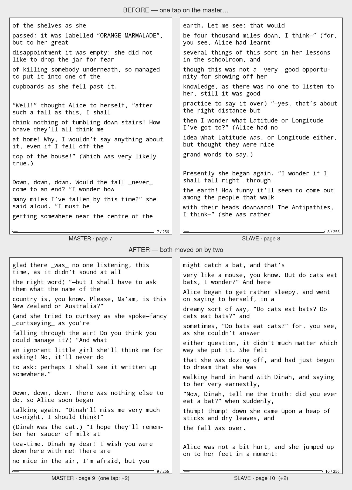
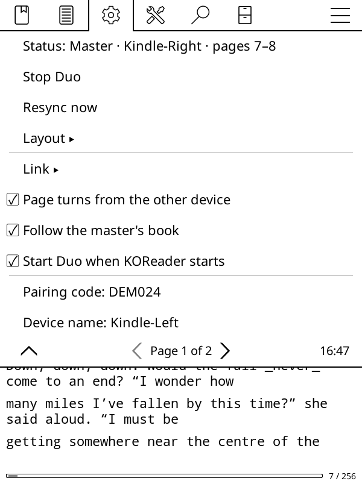
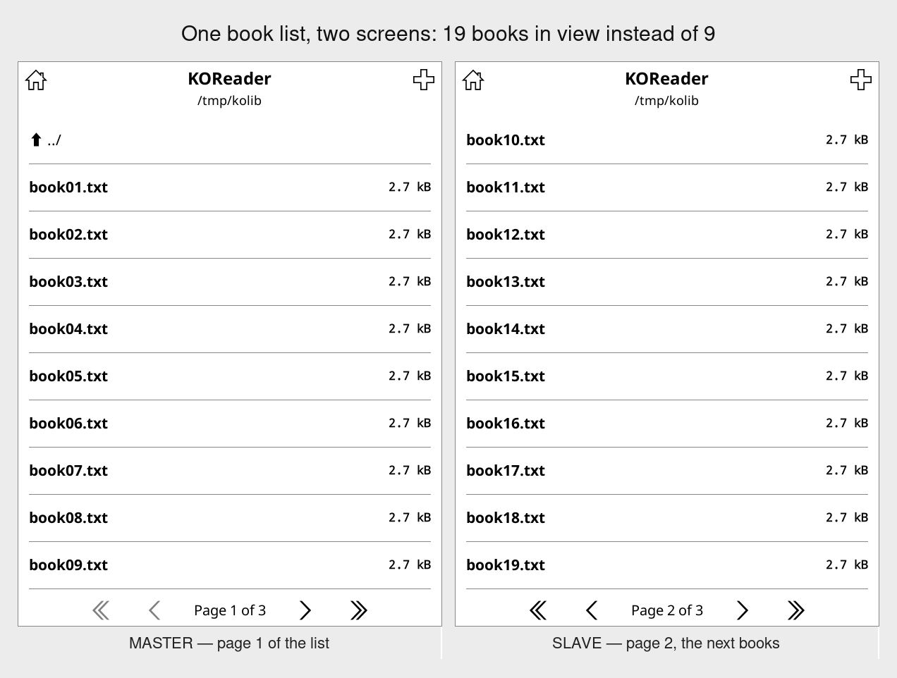
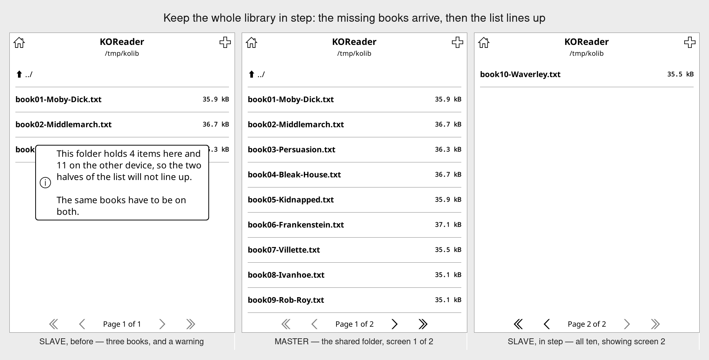
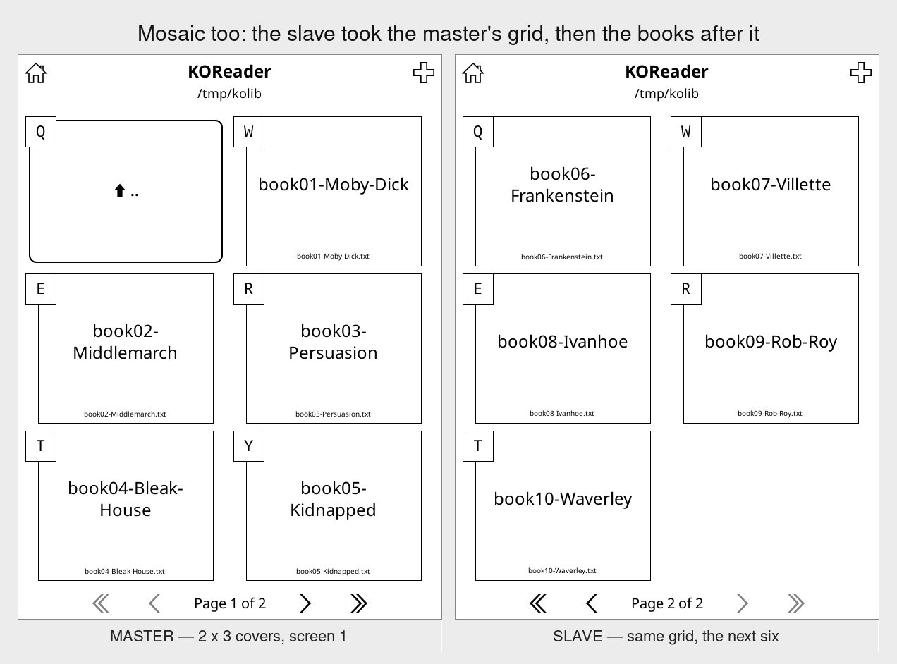

# KOReader Duo

Two e-readers, side by side, showing one book as a two-page spread.

One device is the **master**: it owns the page number and tells the other
what to display. The other is the **slave**: it shows the page it is given
and can pass page turns back. Put them next to each other and you get a left
page and a right page, and a single tap moves both.



Two copies of KOReader, side by side, reading Project Gutenberg's *Alice's
Adventures in Wonderland*. The master is on page 13 and the slave on page
14, and the prose runs straight across the gap: the left screen ends *"she
was now the right size for going"* and the right one picks up *"through the
little door into that lovely garden."* One tap moves the pair to 15 and 16 —
by two, so no page is read twice and none is skipped.

It also does **mirror mode**, where both devices show the same page — handy
for reading along with somebody else.

Nothing about the design stops at two devices: a third one joins as slot 2,
shows the page after the slave's, and a turn moves all three at once.

## Installing

Copy `duo.koplugin` into KOReader's `plugins` directory on **both** devices
and restart KOReader.

```sh
make install KOREADER=/mnt/us/koreader     # jailbroken Kindle
# or just:
cp -r duo.koplugin /path/to/koreader/plugins/
```

The plugin appears under **☰ → Network → Duo (two-device spread)**, in the
reader and in the file manager.

## Pairing

On the device that should hold the **left** page:

1. **Duo → Connect the two devices…**
2. **This is the master (left page)**
3. Note the pairing code and address it shows you.

On the other device:

1. **Duo → Connect the two devices…**
2. **Connect to a master (right page)** — it searches the network and lists
   whatever it finds, so there is normally no address to type.
3. Pick the master, and type the pairing code if asked.

That is it. Open a book on the master and the slave follows: same book, next
page, and one tap moves the pair.

If the search finds nothing (some networks block broadcasts), choose **Type
the address by hand** and enter the address shown on the master.

## Getting the two devices talking

The link is only a byte pipe, so several things can carry it. What a Kindle
will actually give you differs by route.

### Any Wi-Fi network — works today

A home router, or a phone hotspot with no internet on it. Pair as above.
This is the path with the most testing behind it.

### The two devices, direct — no router, no DHCP

For reading somewhere with no network at all. One reader hosts a Wi-Fi link
and the other joins it:

**Duo → Connect the two devices… → No Wi-Fi network? Link the two directly…**

It asks the device what it can do before touching anything, and tells you
plainly when the answer is no. Where it works, the hosting device becomes an
access point if its driver supports one and an ad-hoc network otherwise,
takes `169.254.13.1`, and starts Duo as master. The other device joins,
takes `169.254.13.2`, and connects — the host address is fixed, so there is
no DHCP server needed and no address for anyone to type.

Whether a particular Kindle can do this comes down to its Wi-Fi driver.
Check before you rely on it, over SSH:

```sh
/mnt/us/koreader/plugins/duo.koplugin/tools/duo-direct-link.sh probe
```

That prints the interface, the driver, the modes it supports, and a verdict.
The same script does the work — `host`, `join`, `status`, `restore` — and
takes `--dry-run` on any of them, so you can read the exact commands before
running them. It takes Wi-Fi over while it is up; **restore** or a reboot
gives it back.

### Bluetooth — not on a stock Kindle

Kindles do not run bluez: there is no `rfcomm` and no `hciconfig`. Amazon's
Bluetooth stack is its own, and the community page-turner projects reach it
with a separate userspace stack that speaks HID only. So on a Kindle today
there is no channel for Duo to bind to.

The plugin side is nonetheless finished. A bound RFCOMM channel appears as a
character device, and Duo's serial transport talks straight to one:

```sh
rfcomm bind /dev/rfcomm0 AA:BB:CC:DD:EE:FF 1     # where rfcomm exists
```

Then on both devices: **Duo → Link → Serial line (RFCOMM or UART)**, set
**Serial device** to the path, and start one as master and the other as
slave. There is no address to enter — the line *is* the connection — and the
pairing code still applies. This is tested end to end against a
pseudo-terminal pair, which is exactly what an RFCOMM channel looks like, so
it will work on any device that exposes one: a serial bridge over Amazon's
stack, another platform, or a plain serial cable.

**Bluetooth PAN** needs nothing special at all: it presents as an ordinary
network, so leave Duo on **Link → Wi-Fi** and pair as usual.

### A cable between the two — not with USB alone

The obvious idea is a micro-USB cable with a plug on both ends, and it
cannot work. A Kindle's port is a USB *device* port: it waits to be
enumerated by a host and never does the enumerating. USB needs exactly one
host and one device on a link, so joining two device ports gives you
neither — nothing enumerates, no interface appears, and no amount of
software on either side changes that. Cables sold with two male ends are
for charging or for host-mode phones; on two Kindles they do nothing.

**USBNetwork does not change this**, which is worth saying plainly because
it looks as though it should. It is the jailbreak's headline USB feature
and it is exactly the gadget half: `g_ether`, which makes the reader appear
to a *host* as a USB Ethernet adapter. It is the thing that makes a Kindle
a device. Running it on both ends of a cable gives you two devices waiting
to be enumerated by a host that is not there, and neither `usb0` ever comes
up.

Host mode is the only way round it, and a plain cable would not select it
even on hardware that could. Host mode is chosen by grounding the ID pin,
which is what an OTG adapter does and what a male-to-male cable does not;
the host also has to supply power out of a port that is built to take it
in. So this is a soldering-and-kernel project rather than a cable, and
whether a given model can be made to do it at all is a question for the
people who hack Kindle kernels — not something this plugin can answer.
Everything the jailbreak ships today is on the gadget side.

What does work is putting a host in the middle, and there USBNetwork is
exactly what you want on both readers. Anything that can be a USB host and
route between two USB Ethernet gadgets — a Raspberry Pi, an Android phone
with OTG and tethering, a laptop — gives both readers a
`usb0` interface with an address, and from Duo's point of view that is
simply a network. Nothing in the plugin looks for a wireless card: it takes
whatever interface has an address, so pairing over `usb0` needs no special
setting. It is only worth the trouble if you already have such a thing to
hand; two readers and a Wi-Fi link is the simpler answer, and a phone
hotspot with no internet on it works anywhere.

### A wire with no third device: the debug UART

There is one wired route between two readers and nothing else, and it is
not the USB port. Kindles have a serial console on test pads inside the
case — the same one used to rescue a bricked device. Two of those joined
together, TX to RX each way and a common ground, are a serial line, and
Duo's serial transport talks to any character device: set **Link → Serial
line** and give it the port's name on each side. Nothing else is needed;
there is no address to type and the pairing code still applies.

It is a soldering job, and there are three things to get right:

- **Free the port first.** The UART is normally the kernel console with a
  login on it, so it will be busy answering boot messages rather than
  carrying a spread. Drop the `console=` argument and stop the getty before
  using it.
- **Match the levels.** These pads are 1.8 V on many models and 3.3 V on
  others. Two of the same model are fine wired directly; two different
  ones may need a level shifter, and getting this wrong damages a reader.
- **Expect it to be slow.** At the usual 115200 baud a line carries about
  11 KB a second, and a book travels as text, so call it 8 KB of book per
  second. Page turns are a few dozen bytes and feel instant. A 500 KB
  novel takes about a minute. A whole library does not bear thinking
  about, which is an argument for leaving *covers now, books when you open
  them* switched on. Raise **Serial baud** if the port will take it.

Everything else wired needs something in the middle that can be a USB
host. There is no passive cable that turns two device ports into a link,
and no setting in this plugin — or any other — that can conjure one.

## Settings

Everything lives under **☰ → Network → Duo (two-device spread)**. The top line
is the live connection: which role this device has, which peer it found, and
the pages currently on show.



Everything below, on the master of a pair reading *Alice* together. *Fetch
any missing books now* is greyed out because this is the device the books
come **from** — there is nothing for it to fetch.

| Setting | What it does |
| --- | --- |
| **Layout → Two-page spread** | Master shows page N, slave shows N+1. A turn moves by two. |
| **Layout → Mirror the same page** | Both show the same page. A turn moves by one. |
| **Layout → This device holds the right-hand page** | Swaps the sides: the slave shows the *earlier* page. |
| **Link** | Wi-Fi (any IP network, including Bluetooth PAN), a direct router-free link, or a Bluetooth/serial device. |
| **Match typography** | Keep both devices laying the book out identically. On by default. |
| **Share the book list too** | Spread the file browser across the devices as well. On by default. |
| **Keep the whole library in step** | Fetch whatever books the shared folder is missing here. On by default. |
| **Covers now, books when you open them** | Fill the shelf with covers and titles, and fetch each book the first time it is opened. On by default. EPUB only. |
| **Page turns from the other device** | Off makes the slave a display only. |
| **Follow the master's book** | When the master opens a book, open it here too. |
| **Send the book if the other device lacks it** | Hand the file over the same link when the other device does not have it. On by default. |
| **Start Duo when KOReader starts** | Reconnect on launch in the last role used. |
| **Pairing code** | Shared secret. Empty means any device may connect. |
| **Device name** | What the other device calls this one. |
| **Port** | TCP port, 9970 by default (UDP 9971 for the search). |

Duo also registers two actions for gestures and hardware keys, under
Dispatcher: **Duo: start/stop** and **Duo: resync now**.

## The book list, spread too

The same idea one level up: the master shows the first screenful of the
folder, the next device shows the screenful after that, and one swipe moves
the whole row along. Twice the library in view, and opening a book on either
device opens it on both.



Both devices need the same books in the same folder for the halves to line
up, so **Duo fetches whatever is missing by itself**. When the two folders
disagree, the device that is behind asks for the other's listing, works out
what it lacks, and pulls those books across one at a time — the status line
counts them off. After that the list lines up and stays that way.



That is **Keep the whole library in step**, on by default. Turn it off and
Duo will still spread the list, but it will only tell you the two libraries
differ rather than doing anything about it — which is the left-hand screen
above.

### Covers now, books when you open them

Copying a whole library before anything can be read is a lot of waiting for
books you may never open. So by default Duo sends a **stand-in** for each
book instead: a real EPUB carrying the cover and the title and nothing else.
The shelf fills up at once, the two halves of the list line up straight
away, and the book itself is fetched the first time you open it — landing
over the top of the stand-in and opening as if it had been there all along.


Ten Gutenberg books came to 2.2 MB as stand-ins against 6.2 MB whole, and
the one that was actually opened took five seconds to arrive. The saving
depends entirely on the covers: these are big scans on small books, and a
more usual library — a few megabytes a book, a small cover — saves far more.

Turn **Covers now, books when you open them** off and the whole library is
copied up front instead, as before.

Two limits worth knowing. It is **EPUB only**: a stand-in has to carry the
name of the book it stands in for, so it has to be the same format too, and
there is no such thing as a PDF with no pages — anything else is copied
whole. And a book cannot be *read* while it downloads, whatever the format:
an EPUB is a zip whose index sits at the end of the file, so there is no
first page to show until the last byte lands. What Duo does instead is start
the moment you tap, and open the moment it is there.

Only the folder on show is ever involved, and only the books in it: a
request carries a bare file name that has to appear in that listing, and the
path is rebuilt from the shared folder, so nothing outside it can be asked
for however the name is spelled.

Items per page is matched along with the typography, since that is what
decides where one screenful ends and the next begins. Three widgets can be
drawing that list and they disagree about where the number comes from — the
plain file browser reads it from KOReader's settings, the cover browser's
list mode works out its own and ignores that setting, and its mosaic mode
has no such number at all, only a grid. Duo tells whichever one is actually
in charge, in its own terms.

**Mosaic (the cover grid) works too**, including the spread: the shape
travels with the page, so a device showing 2 × 3 covers puts the other one
on the same grid and takes the next six books.



Ten Project Gutenberg EPUBs at `/tmp/kolib`, seven of which the right-hand
device did not have a minute earlier — it fetched them over the link, covers
and all, and every file matched the sender's checksum.

A grid can only be matched
against another grid, though. Told only that the other device fits eight,
there is no way to know whether that means two by four or one by eight, and
guessing would rearrange your screen — so if one device is on a grid and
the other on a list, Duo leaves both alone and says the halves will not line
up until you put them on the same display mode.

A turn moves the row by as many screenfuls as there are devices, exactly as
a page turn does in a book: with two devices showing screens 1 and 2, one
swipe takes them to 3 and 4, so nothing is looked at twice and nothing is
skipped. That holds in the cover grid too — the cover browser changes how a
screenful is measured, not how it is turned — and a swipe on either device
moves the pair.

Unlike KOReader's own paging, the shared list stops at the last screenful
rather than wrapping round to the first — wrapping would put the devices on
unrelated parts of the list. At the very end both devices show the last
screenful, the same way both show the last page at the end of a book.

Switch it off with **Share the book list too** if you would rather browse
independently and only share the reading.

## Sending the book

Following someone else's reading is not much use if you cannot open what
they are reading. When the master opens a book the other device does not
have, that device asks for it and the file comes down the same link the page
numbers do — then opens, at the right page, as part of the spread.

Nothing to set up: it is on by default, and there is no server, no cable and
no cloud account involved. The status line shows the progress while it runs.

- **Only the open book can be asked for.** A request names a file, and the
  master answers only if that is the book it actually has open. There is no
  way to ask a paired device for an arbitrary path.
- **Books land in a `Duo` folder** inside your library, so they turn up in
  the file manager where you would expect.
- **Half a book is never left behind.** The file is written to a part-file
  and only moved into place once all of it has arrived and the size matches.
- **There is a size limit** — 64 MB by default — so a mistyped tap cannot
  push a 2 GB scan down a slow link.
- **A transfer that dies says so.** If a chunk cannot go out, the sender
  tells the other device rather than stopping mid-book; and a book that goes
  thirty seconds without a byte is written off at the receiving end, so one
  bad transfer cannot wedge every book after it.

Over Wi-Fi an EPUB of a few hundred kilobytes takes a handful of seconds —
about 100 KB/s, since the bytes travel as text on the same line-based link
the page numbers use. Over a serial line it will take as long as the line
takes; the transfer is chunked and paced by how fast the other end drains
it, so a slow link makes it slow rather than making it fail.

A book travels base64-encoded, in the URL-safe alphabet rather than the
usual one. That detail matters more than it looks: the protocol's lines
carry a restricted character set and escape everything else, and `+` and `/`
are not in it. A compressed file — which every EPUB is — produces enough of
them to push a chunk past the line limit, and the transfer would fail part
way through a real book while sailing through any test written with tidy
data. Two characters' difference and nothing needs escaping at all.

## Matching typography

A spread only works if both devices break the lines in the same places, and
"please set the same font size on both" is an instruction nobody follows.
So Duo does it.

**When you connect, the master's settings win.** Afterwards, change anything
on *either* device and the rest follow — including the master, when the
change was made on a slave. The master is still the only device that decides:
a slave hands its change over, the master applies it and passes it on.

What gets matched — everything that moves a line break:

> typeface · font size · font weight · hinting · kerning · line spacing ·
> word spacing · word expansion · CJK width scaling · left/right margins ·
> top and bottom margins · view mode · columns · block rendering mode ·
> zoom (render DPI) · embedded styles · embedded fonts · status bar

What is left alone, because it is yours or particular to one device:

> rotation · night mode · frontlight · image smoothing · refresh settings ·
> anything not affecting where the text falls

Changed the wrong device's settings? **Undo: restore my own typography**
puts back what this device had before Duo first changed anything. Duo only
records that snapshot when it actually changes something, so the undo is
never offered for a change that never happened.

Two caveats worth knowing:

- **A typeface has to exist on both devices.** If the master is using one
  this device does not have, Duo says so rather than silently leaving the
  pages misaligned.
- **Different screen sizes cannot be matched.** Two different Kindle models
  will paginate differently whatever the settings. That is the one case Duo
  warns about — once, after matching has been tried and the pages still
  disagree.

Reflowable formats only. A PDF has the pages the file says it has, so two
devices agree about it regardless, and Duo does not touch its settings.

## How it works

- **One authority.** The master is the only device that decides what page
  anything shows. A tap on the slave is a *request*: it is sent to the
  master, which moves and then tells everyone where they now stand. The two
  screens cannot drift apart, because only one of them is ever deciding.
- **Page turns are intercepted, not simulated.** Every tap, swipe, gesture
  and hardware button ends up in the reader's `onGotoViewRel`, so Duo wraps
  that one method and multiplies the distance by the number of devices.
  Absolute jumps — table of contents, the go-to dialog, a link — are left
  alone; they change the page, and the spread follows from the resulting
  `PageUpdate`.
- **The connection outlives the plugin.** KOReader destroys and rebuilds a
  plugin instance every time you open a book, so the engine lives in a
  module singleton (`duo/core.lua`) and the plugin instance only attaches a
  binding to the current document. Changing books does not drop the link.
- **Pairing without sending the secret.** The master challenges with a
  nonce; each side answers with `SHA-256(nonce:code)`. The code itself never
  goes on the wire, and a captured proof is useless next time. This keeps
  the wrong device from connecting; it is not protection against somebody
  who controls your network.
- **Wire format** is one line per message — `STATE page=13 pages=300` —
  percent-encoded so titles and paths survive. No JSON library, and legible
  in a packet dump.
- **Polling** happens inside KOReader's own UI loop, which visits registered
  sockets at least every 50ms. Nothing here spawns a thread, blocks a read
  or keeps the CPU awake between page turns.

## Things worth knowing

- **Typography is matched for you.** Page numbers only line up if both
  devices break the lines in the same places, so Duo keeps the settings that
  decide that in step (see below). It stays quiet about a mismatch it is
  about to fix; it speaks up only when the pages still do not line up with
  the settings already matched, which means the screens themselves differ.
- **Keep Wi-Fi on.** If KOReader is set to drop Wi-Fi after a while, the
  link goes with it. Duo reconnects by itself, but the gap is visible.
- **Sleep.** Duo shuts its sockets down cleanly on suspend and brings them
  back on resume, rather than leaving the other device timing out.
- **Kindle firewall.** Kindles drop incoming connections by default; the
  master opens the port with `iptables` while it runs and closes it again
  when it stops.
- **Battery.** The heartbeat is one small packet every four seconds on an
  already-open socket. Wi-Fi being on at all is the real cost.

## Tests

```sh
make test          # everything, on LuaJIT
make test LUA=lua5.1
```

203 tests, no mocking of the interesting parts:

| Suite | Tests | What it covers |
| --- | --- | --- |
| `protocol_spec` | 24 | Framing, escaping, byte-at-a-time reassembly, SHA-256 vectors, reading our own address out of `ip`/`ifconfig` |
| `link_spec` | 13 | Real loopback sockets: connect, refuse, partial writes, handshake, heartbeats, and a check that the pairing code never appears on the wire |
| `plugin_spec` | 23 | The real `main.lua` under a stub KOReader: menus, page-turn interception, the reader binding |
| `integration_spec` | 49 | **Two and three device processes over real TCP**: spreads, turns from either device, absolute jumps, mirror, reverse, end of book, reconnects, document following, typography converging from both directions, a book sent between devices, and one book list spread across two screens |
| `serial_spec` | 7 | The same two processes over a pseudo-terminal pair, standing in for a bound RFCOMM channel |
| `typography_spec` | 12 | Reading, encoding and applying layout settings, including margin pairs and a missing typeface |
| `library_spec` | 10 | **The whole library brought into step**: the slave in its own mount namespace with a different folder at the same path, so the books really have to travel, and no complaint about a mismatch it is busy repairing |
| `browser_spec` | 15 | Reading and paging the book list, the listing hash, matching a screenful through all three widgets that draw it — plain browser, cover-browser list, cover-browser grid — and refusing a folder the device does not have |
| `booktransfer_spec` | 16 | Both base64 alphabets against the published vectors, every byte value round-tripped, a full chunk of the worst bytes that exist kept inside the line limit, short and oversized transfers refused, and a peer that tries to name its own destination |
| `epubstub_spec` | 16 | Reading the cover out of an OPF the three ways EPUBs name one, and building a stand-in that survives being read back |
| `directlink_spec` | 13 | Driver capability probing against real `iw` output shapes, and the exact commands each method issues |
| `directlink_net_spec` | 5 | **Two network namespaces on a link-local /16**: the router-free network, with search, connection and spread across it |

Two tools double as documentation, and both print live data:

```sh
luajit tools/duo-demo.lua 3      # run three devices, print what each displayed
luajit tools/duo-menu-dump.lua   # print the menu exactly as the device builds it
```

The suite runs the plugin against `spec/harness`, which provides the frontend
API KOReader exposes — the same module names, signatures and event-propagation
rules — with `main.lua` loaded unmodified, exactly as KOReader's plugin loader
does it. That keeps the suite fast and lets it stage things that are tedious to
arrange in a running application: a yanked connection, a wrong pairing code,
two network namespaces. The devices in the integration suites are separate
operating-system processes sharing nothing but a socket.

The harness is not the last word, though — see below.

## Verified in KOReader itself

The screenshots above are two copies of **KOReader v2026.03** running the
plugin: separate processes, separate settings directories, paired over a real
socket, with Project Gutenberg's *Alice in Wonderland* — the EPUB, laid out
by KOReader's own crengine in Noto Serif — and page turns arriving as real
events through its input stack. The status line in the settings screenshot —
`Master · Kindle-Right · pages 7–8` — is the plugin reporting the live
connection.

Both of the features above were checked there too, not only in the suite:

- **Typography.** Raising the font size in the master's own settings panel
  moved the slave with it, on a real EPUB. The follower relaid the book out,
  put itself back on the right page without waiting for a page turn, and the
  prose still ran across the gap — with nothing said about the two devices
  disagreeing while the change was in flight.
- **Sending the book.** With the master's library hidden from the slave (a
  tmpfs over it in a private mount namespace, so the file really was
  missing), the slave asked for the book, received all 174,311 bytes —
  identical MD5 — and opened it as page 10 of the spread while the master
  sat on page 9.
- **The whole library.** Same trick, one folder up: `/tmp/kolib` on the
  slave was a tmpfs in its own mount namespace holding three books, against
  the master's ten at that same path — ten real Project Gutenberg EPUBs, not
  test fixtures. On connecting, the slave fetched the seven it lacked, 4.2 MB
  in forty seconds, every file matching the sender's MD5, and moved itself to
  the second screenful without being told. It said nothing about the mismatch
  on the way, which is the point: the warning is for a difference nothing is
  going to fix.

  Real books are also what turned up the transfer bug described below. A
  library of fixtures would not have.
- **Paging the grid.** Thirty books in a 2 x 3 grid of covers, six
  screenfuls. The pair started on 1 and 2; one tap on the master's
  next-page arrow took them to 3 and 4, another to 5 and 6, and a third
  stopped at the end rather than wrapping. A finger-swipe on the *slave*
  moved the row back to 4 and 5, so a turn works from either side.
- **Covers first.** With the shelf empty on one side, the ten books arrived
  as stand-ins — 2.2 MB against 6.2 MB — covers drawn by KOReader's own
  cover browser out of files holding no book at all, and the two halves of
  the list lined up at once. Tapping *Wuthering Heights* fetched the real
  587,526 bytes in five seconds, over the top of the stand-in, and opened it
  at page 1 of 705.
- **Matching the screenful.** Checked against all three of the widgets that
  draw the list. With the plain browser the slave went from 6 items a screen
  to the master's 10; with the cover browser in list mode, where the global
  setting does nothing, it went from 6 to 10 through that plugin's own
  `files_per_page`; in mosaic mode it went from a 2 × 2 grid to the master's
  2 × 3 and took books 6–10 while the master showed 1–5. Given a screen too
  short to fit ten rows the widget overrode the count back to nine, and Duo
  said so rather than pretending the halves lined up.

To repeat it on a desktop:

```sh
# any recent release; assets are per-tag, so check the name for yours
curl -L -o koreader.AppImage \
  https://github.com/koreader/koreader/releases/download/v2026.03/koreader-v2026.03-x86_64.AppImage
chmod +x koreader.AppImage && ./koreader.AppImage --appimage-extract
cp -r duo.koplugin squashfs-root/usr/lib/koreader/plugins/

# two instances, each with its own HOME so their settings stay apart
cd squashfs-root/usr/lib/koreader
KO_MULTIUSER=1 HOME=/tmp/ko1 ./reader.lua /path/to/book.epub &
KO_MULTIUSER=1 HOME=/tmp/ko2 ./reader.lua /path/to/book.epub &
```

One difference from a Kindle worth knowing if you compare against the
screenshots above: the desktop build reports a keyboard, so KOReader draws
a Q/W/E/R shortcut key beside every row of the file browser. A Kindle has no
keyboard and shows none. To match, drop this in
`$HOME/.config/koreader/patches/2-no-item-shortcuts.lua`:

```lua
require("ui/widget/menu").is_enable_shortcut = false
```

Then pair them from the menu as usual, with the second one connecting to
`127.0.0.1`. Setting `["autostart"] = true` and `["autostart_role"]` in
`$HOME/.config/koreader/settings/duo.lua` skips the tapping.

## Layout

```
duo.koplugin/
  main.lua                  KOReader glue: menus, events, page-turn wrapping
  _meta.lua
  duo/
    core.lua                the engine: roles, links, who shows which page
    spread.lua              spread arithmetic, kept dependency-free
    typography.lua          keeping both devices laying the book out alike
    browser.lua             the book list, spread across the devices
    booktransfer.lua        sending the book file itself, a chunk at a time
    base64.lua              so a book fits down a line-based link
    link.lua                one authenticated connection: handshake, heartbeat
    protocol.lua            message framing
    transport_tcp.lua       non-blocking TCP, for Wi-Fi and Bluetooth PAN
    transport_serial.lua    non-blocking character device, for RFCOMM
    discovery.lua           UDP search, so nobody types an IP address
    directlink.lua          the router-free link: probe, host, join
    netutil.lua             local address, Kindle firewall
    sha256.lua              for the pairing proof
    util.lua
  tools/
    duo-direct-link.sh      brings the router-free Wi-Fi link up and down
spec/                       tests and the KOReader harness
tools/
  duo-demo.lua              runs a real session and prints what each device showed
  duo-menu-dump.lua         prints the menu as the device builds it
```

## License

This plugin is intended to be used with, and distributed under the same terms
as, KOReader itself: **AGPL-3.0**.
